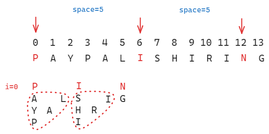

[TOC]

思路

这道题目可以通过寻找***Z*型结构中每行字符**在**原字符串的间隔**来一次性构造目标字符串。

*n=3*

先看下*n=3*的情况。

如果我们把目光放在第一行（*i=0*），可以看到每个字符在原字符串中相隔*3*个字符：

第二行（*i=1*）每个字符在原字符串中相隔*1*个字符：

第三行（*i=2*）与第一行相同，每个字符在原字符串中相隔*3*个字符：

到这里，我们大概能够看出这种规律具有**一定的对称性**，即**第一行与倒数第一行，第二行与倒数第二行的字符在原字符串中的间隔符合相同的规律**，其他对称行数可类推。

但是*n=3*能够得到的信息并不多，我们再看下*n=4*的情况。

*n=4*

第一行（*i=0*）每个字符在原字符串中相隔*5*个字符：

第二行（*i=1*）时表现出了与*n=3*时不同的规律，此时第一个间隔为*3*个字符，而第二个间隔为*1*个字符，然后循环这个规律：

第三行与第二行对称，但是又存在一些区别。

第三行（*i=2*）中，第一个间隔为*1*个字符，第二个间隔为*3*个字符，然后循环这个规律：

第四行与第一行相同，这里就不再赘述 。

规律

如果我们继续分析下去，假设*Z*型字符串有*n*行，用*i*表示行标，则：

- *i=0*时，字符在原字符串中的间隔为 $(n-1)*2-1$；

- *i=1*时，字符在原字符串中的间隔在 $(n-2)*2-1$ 与 $1$ 之间切换；

- *i=2*时，字符在原字符串中的间隔在 $(n-3)*2-1$ 与 $3$ 之间切换；

  ...

- ***i=m*时，字符在原字符串中的间隔在 $(n-m-1)*2-1$ 与 $m*2-1$ 之间切换；**

  ...

- *i=n-1*时，字符在原字符串中的间隔为 $(n-1)*2-1$

综上，可以分析出除了第一行和最后一行，中间每行的字符串间隔会在 $(n-i-1)*2-1$ 与 $i*2-1$。

根据这个规律，我们可以每行都存储一个间隔数组，该数组有两个元素，第一个元素为第一个间隔，即 $(n-i-1)*2-1$ ，第二个元素为第二个间隔，即 $i*2-1$，通过一个控制变量 `control` 递增取模，便可以实现交替更改间隔值。

> 第一行和最后一行时，数组中的两个元素均为 $(n-1)*2-1$ 。